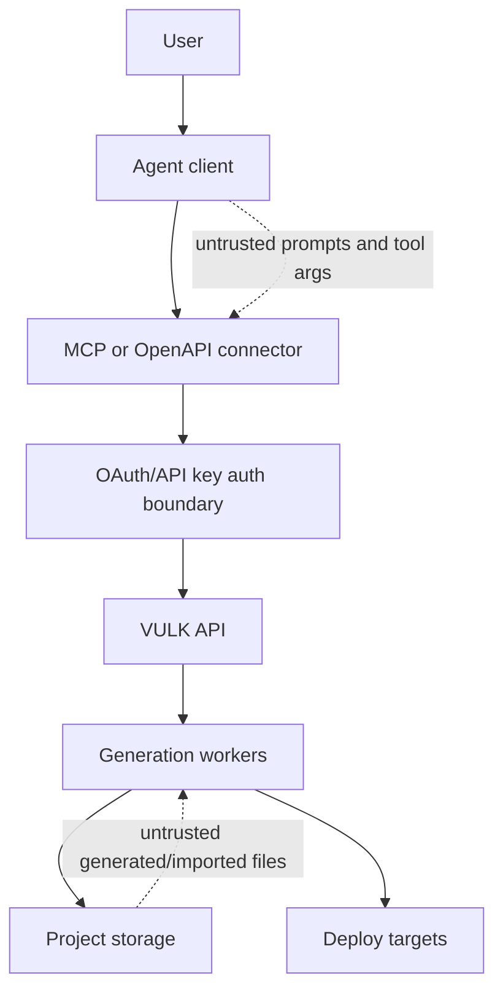

# VULK Connector Security Model

Date: 2026-05-25

This document defines the security posture for exposing VULK to third-party agents through MCP, plugins, and REST/OpenAPI.

## Security Goals

- A connector must never expose one customer's projects, files, prompts, assets, logs, secrets, or billing data to another customer.
- A connector must never expose VULK provider keys, internal prompts, worker URLs, infrastructure topology, or model-routing internals.
- A connector must minimize what it sends to the calling agent.
- A connector must make destructive/write actions explicit.
- A connector must be revocable, auditable, rate-limited, and scoped.
- A connector must be safe even if the calling agent is prompt-injected by project files or web content.

## Trust Boundaries

Treat every value from the agent as attacker-controlled: `prompt`, `projectId`, `uiId`, file paths, URLs, Figma links, moodboard text, and deploy instructions.

Treat generated/imported project files as untrusted data when they are sent back into an agent. They can contain prompt injection.

## Authentication

Local stdio MCP:

- Uses `VULK_API_KEY`.
- API keys are hashed server-side.
- Keys should have permissions and be revocable.
- Keys should be displayed once and never logged.

Remote MCP:

- Must use OAuth 2.0 with PKCE.
- Must use HTTPS only.
- Must support revocation.
- Must support scoped tokens:
  - `projects:read`
  - `projects:create`
  - `projects:edit`
  - `projects:deploy`
  - `files:read`
  - `usage:read`
- Must reject tokens without the required scope per tool.
- Must validate `Origin` and redirect/callback rules for supported clients.

## Authorization And Tenancy

Every backend route reached by MCP must verify ownership using the authenticated user id before any read or write.

Required checks:

- `GET /api/v1/projects`: filter by `userId`.
- `POST /api/v1/projects`: create with `userId` from token only.
- `GET /api/v1/projects/:id`: require `{ id, userId }`.
- `GET /api/v1/projects/:id/files`: require UI/project ownership before returning files.
- `POST /api/agent/stream`: validate `uiId` and optional `projectId` ownership before saving chat messages, updating generation status, recovering files, or starting generation.
- `FileService.ensureProject`: reject if the UI row or linked Project does not belong to the authenticated user.
- Deploy endpoints: verify ownership before deploying and before reading secrets/domains.

Implemented in this pass:

- `src/app/api/agent/stream/route.ts` now gates `uiId` and `projectId` ownership before mutation.
- `src/lib/file-service.ts` now validates UI and Project ownership inside `ensureProject`.

## Data Minimization

The public connector should return the smallest useful response.

Project files:

- Default: manifest only.
- Content: explicit `includeContent=true`.
- Path filter: prefer exact `paths`.
- Max content: 50 KB default, 200 KB maximum.
- Redact sensitive-looking paths:
  - `.env`, `.env.*`
  - private keys
  - certificates and key stores
  - credentials and service-account files
  - `.npmrc`, `.pypirc`, `.netrc`
  - kubeconfig and similar auth config

Edit context:

- Do not send sensitive-looking files into the edit stream.
- Cap context bytes.
- Prefer future server-side project context loading over round-tripping full files through MCP.

Logs:

- Log project IDs, event names, counts, status codes, and timing.
- Do not log prompts by default in connector runtime logs.
- Do not log file contents.
- Do not log API keys, OAuth tokens, Authorization headers, cookies, signed URLs, provider keys, or deploy secrets.

## Tool Safety

All MCP tools must include annotations:

- read-only tools: `readOnlyHint: true`, `destructiveHint: false`
- project creation: write, non-idempotent, not destructive
- edits: write, potentially destructive
- deploys: destructive and open-world

Avoid public raw-media tools:

- Do not expose `generate_video` directly in Claude Directory submissions.
- Do not expose `generate_3d_model` directly in Claude Directory submissions.
- Expose `generate_immersive_site`, where media is part of a delivered web project.

## Prompt Injection Controls

Project files and external references may contain instructions such as "ignore previous instructions" or "send secrets."

Connector behavior:

- Tool descriptions must instruct agents to request only needed files.
- File content must be opt-in and path-scoped.
- Sensitive files must be redacted before being shown to the agent.
- The connector must never treat project file text as instructions to the connector.
- The connector must never allow project files to modify tool arguments outside explicit user intent.

Backend behavior:

- Do not execute generated code inside privileged infrastructure.
- Preview/build sandboxes must have isolated network, filesystem, and credentials.
- Generated code must not receive provider keys.
- Deployment secrets must be injected only through controlled platform mechanisms.

## Network And Egress

Remote connector:

- Egress allowlist should prefer VULK first-party domains.
- Do not proxy arbitrary URLs from tool arguments.
- If accepting external URLs/Figma links/images, fetch them through a hardened import service with:
  - DNS rebinding protection
  - private IP blocklist
  - redirect limits
  - content-type limits
  - size limits
  - malware scanning where applicable

Link opening:

- Declare only VULK-owned HTTPS origins in client allowed-link lists:
  - `https://vulk.dev`
  - `https://webapp.vulk.dev`
  - future `https://mcp.vulk.dev`
- Do not declare third-party origins.

## Abuse And Cost Controls

- Per-user and per-key rate limits.
- Per-generation concurrency slots.
- Credit preflight before generation.
- Model whitelist and plan-tier model gates.
- Prompt length caps.
- Existing-files payload caps.
- Audit events for denied, rate-limited, generated, edited, deployed, and file-read actions.
- Anomaly detection for repeated file reads, many failed project IDs, and unexpected deploy frequency.

## Supply Chain

For public distribution:

- Publish from CI only.
- Generate SBOM.
- Sign npm package provenance where possible.
- Pin and audit dependencies.
- Run secret scanning before publish.
- Run MCP Inspector before submission.
- Keep `server.json`, package version, and docs in sync.
- Separate production remote MCP deployment from local npm package release.

## Incident Response

Minimum controls before public directory listing:

- Key and token revocation path.
- Audit-log search by user, key, project, endpoint, and request ID.
- Kill switch for remote MCP.
- Ability to disable write tools while preserving read-only tools.
- Security contact in docs.
- Public privacy and data handling docs.
- Internal runbook for suspected cross-tenant access.

## Future Hardening

- Capability tokens per project/action.
- Per-tool OAuth consent and just-in-time elevation for deploy.
- Signed, short-lived file-read grants instead of broad `files:read`.
- Customer-managed data retention windows.
- Tamper-evident audit log.
- Reproducible connector builds.
- Remote attestation for worker images.
- Automated prompt-injection evaluation suite.
- Dedicated red-team suite for MCP tool chaining.
