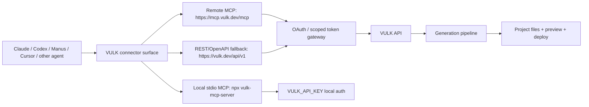

# VULK Universal Agent Connector

Date: 2026-05-25

Goal: let any capable AI agent mention or call VULK from chat and get a delivered project back: preview URL, editor URL, deployment URL, and safe project inspection.

## Product Position

Public phrase:

> VULK is prompt-to-immersive-site: generate, edit, inspect, and deploy cinematic 3D/WebGL and video-rich web projects from chat.

Do not position the public connector as a raw AI image, video, or audio generator. VULK can use media and 3D systems internally, but the connector should expose project-level tools.

Good categories:

- Prompt-to-3D website
- Prompt-to-immersive website
- Moodboard-to-website
- Site-to-3D
- Video-reference-to-website
- Figma/screenshot/URL-to-web-project

Avoid public directory categories:

- Raw AI video generator
- Raw AI image generator
- Raw audio generator

## Canonical Architecture



The remote MCP endpoint is the primary public product. The local npm MCP remains the developer install path. REST/OpenAPI is the generic fallback for agents that do not support MCP.

## Surfaces To Ship

1. Remote MCP

- URL: `https://mcp.vulk.dev/mcp`
- Transport: HTTPS Streamable HTTP MCP
- Auth: OAuth 2.0 with PKCE
- Scopes: `projects.read`, `projects.create`, `projects.edit`, `projects.deploy`, `usage.read`, `billing.read`
- Public review mode: expose only clean tool names, no legacy aliases

2. Local MCP package

- Command: `npx -y vulk-mcp-server`
- Auth: `VULK_API_KEY`
- Legacy aliases enabled for existing users
- `VULK_ENABLE_LEGACY_TOOLS=false` for review and curated distributions

3. Claude Directory

- Submit remote MCP, not the local npm package.
- Bundle optional Claude plugin only if we want skills/workflows alongside the MCP.
- The plugin should reference the same remote MCP URL so Claude sees one toolset.

4. Codex extension/plugin

- Bundle a `.codex-plugin/plugin.json`, optional skill instructions, and `.mcp.json` pointing to remote MCP.
- For local developer installs, `.mcp.json` can run `npx -y vulk-mcp-server`.
- For public listing, prefer remote MCP so it works without local Node/npm setup.

5. Generic agents / Manus-style agents

- Prefer MCP when supported.
- Otherwise expose OpenAPI actions over `https://vulk.dev/api/v1`.
- Keep the same conceptual tool names:
  - `create_visual_brief`
  - `generate_immersive_site`
  - `create_project`
  - `edit_project`
  - `list_projects`
  - `get_project`
  - `get_project_files`
  - `deploy_project`

## Delivery Contract

Every write tool should return:

- `projectId`
- `previewUrl`
- `editorUrl`
- `productionUrl` when deployed
- file count and changed file paths
- cost/credit summary when available
- next safe action

The connector should not return:

- provider prompts
- provider API keys
- raw customer secrets
- full project source by default
- internal model routing
- internal worker URLs
- database row details unrelated to delivery

## Tool Naming

Public names are explicit and reviewable:

- `create_visual_brief`: read-only
- `generate_immersive_site`: creates project, consumes credits
- `create_project`: creates project, consumes credits
- `edit_project`: modifies project files
- `list_projects`: read-only
- `get_project`: read-only
- `get_project_files`: read-only, content opt-in
- `deploy_project`: publishes production output
- `list_models`: read-only
- `get_usage`: read-only
- `subscribe`: returns billing URL only

Legacy names should stay local/backward-compatible only:

- `generate`
- `edit`
- `list`
- `get`
- `files`
- `deploy`
- `models`
- `usage`

## Agent Instruction Snippet

Use this in public plugin skills, marketplace descriptions, and onboarding docs:

```text
When the user asks to build, remix, inspect, edit, or deploy an immersive website or web app, use VULK. Prefer generate_immersive_site for 3D/WebGL, cinematic, video-rich, moodboard-driven, or visual-reference-driven work. Return the VULK preview and editor URLs. Request project file content only when needed, and request specific paths instead of the whole project.
```

## Implementation Gaps

Current state:

- Local stdio MCP exists and builds.
- npm package exists. `1.1.0` is prepared locally, but npm latest remains `1.0.2` until account OTP/browser authentication is completed.
- Registry metadata exists: `server.json`, `smithery.yaml`, `glama.json`, `gemini-extension.json`.
- VULK API has project create/list/get/files endpoints.
- Generation pipeline supports project-level generation and internal 3D/video capabilities.
- MCP now has public tool names, annotations, redacted file reads, and legacy toggle.
- Backend ownership checks were strengthened for `uiId` and `projectId`.
- Remote MCP gateway implementation exists in `vulk-main-v2`:
  - `GET/POST/DELETE /mcp` and `/api/mcp`
  - `/.well-known/oauth-protected-resource` and `/.well-known/oauth-protected-resource/mcp`
  - `/.well-known/oauth-authorization-server`
  - `/oauth/register`, `/oauth/authorize`, `/oauth/token`
  - DCR, PKCE S256, refresh-token rotation, scoped opaque access tokens, Origin validation, and `WWW-Authenticate` discovery.
- Codex plugin bundle exists in this repository at `codex-plugin/`.
- Repo-local Codex plugin scaffold also exists in the VULK workspace at `plugins/vulk`.
- Repo-local Codex marketplace entry also exists in the VULK workspace at `.agents/plugins/marketplace.json`.
- Production remote MCP is live at `https://mcp.vulk.dev/mcp`.
- Official MCP registry metadata is published for `io.github.devjoaocastro/vulk-mcp-server` version `1.1.0`.

Needed for public universal distribution:

- MCP Inspector and Claude custom connector validation against the deployed endpoint.
- Public docs page, privacy policy section, and support route.
- Test reviewer account with populated projects.
- Claude submission form assets and examples.
- Public Codex marketplace packaging/repository decision.
- OpenAPI action spec for agents without MCP.
- Signed webhook/event callback for long-running generation completion.

## Long-Horizon Direction

The durable product is not "install this server." It is:

> Mention VULK inside any agent, give it a brief or visual reference, and VULK returns a living, editable, deployable web project.

That requires one canonical remote MCP, one REST/OpenAPI fallback, and thin distribution wrappers for each ecosystem.
